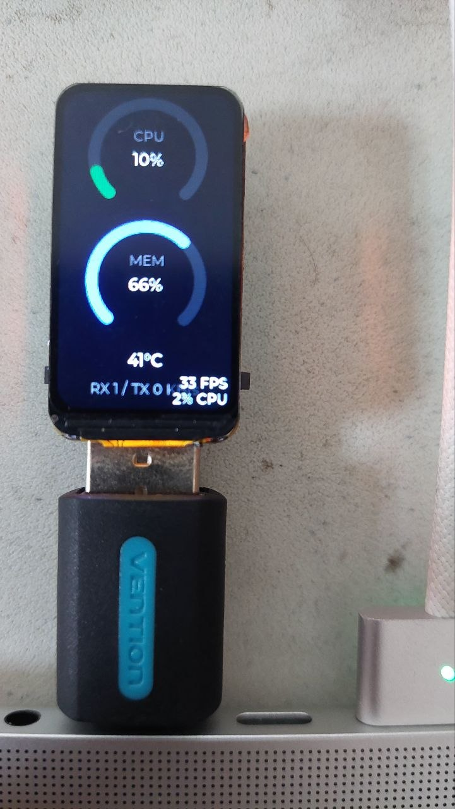

# USB System Monitor — ESP32-S3-LCD-1.47

A hardware system monitor. The Waveshare **ESP32-S3-LCD-1.47** plugs into a PC
over its USB Type-A plug and shows live host stats on its 172×320 LCD:

- **CPU** and **MEM** as arc gauges (with centered %)
- **CPU temperature** as a large readout
- **RX / TX** network throughput
- the onboard **RGB LED** shifts green → red with CPU load

A small host agent samples the stats and streams one line per second to the
board over the native USB CDC serial link. Linux uses Python, macOS has a native
Swift agent, and Windows has a .NET agent. If the host stops sending, the board
greys the gauges and shows **"waiting for host"** within ~3 s, then recovers
automatically when data resumes.

See `CLAUDE.md` for the full spec.

## Layout

```
.                       # ESP-IDF firmware project (this repo)
├── main/
│   └── Sysmon/         # the system-monitor module: USB link + LVGL UI
│       ├── sysmon.c
│       └── sysmon.h
└── host/               # host agents
    ├── sysmon.py
    ├── requirements.txt
    ├── sysmon/         # native Swift macOS agent and Swift package
    ├── windows/        # standalone .NET Windows host agent
    └── usb-sysmon.service   # systemd --user unit
```

The firmware is built with **ESP-IDF** (not the Arduino default from the spec):
it reuses the Waveshare ESP-IDF + LVGL 8.3 display scaffold already in this repo
(ST7789 bring-up, including the 34 px column offset, and the WS2812 driver).

## Line protocol

Newline-terminated `KEY:value` pairs, integers only:

```
CPU:42,MEM:67,TMP:58,RX:1234,TX:88\n
```

- `CPU`, `MEM` — percent (0–100)
- `TMP` — CPU temperature, °C
- `RX`, `TX` — network throughput, KB/s
- `GPU` — optional GPU utilisation % (NVIDIA, with `--gpu`)

## Host agent

The agent runs on **Linux, macOS, and Windows**. It auto-detects the board by USB
VID `0x303A` (Espressif) and reconnects automatically if the board is
unplugged/replugged.

```sh
cd host && pip install -r requirements.txt
python3 sysmon.py            # core fields
python3 sysmon.py --gpu      # also stream GPU% if an NVIDIA GPU is present
```

### Linux (Fedora)

Add yourself to `dialout` so the serial port can be opened, then **re-login**:

```sh
sudo usermod -aG dialout $USER
```

CPU temperature comes from `psutil` sensors (Intel `coretemp` / AMD `k10temp`).

Auto-start with the systemd `--user` unit (edit `ExecStart` to this repo's path
first):

```sh
cp host/usb-sysmon.service ~/.config/systemd/user/
systemctl --user enable --now usb-sysmon.service
```

### Windows

Use the standalone .NET 10 agent for Windows. It streams the same serial
protocol as `host/sysmon.py`, but reads CPU temperature directly through
`LibreHardwareMonitorLib` instead of relying on WMI:

```powershell
cd host\windows\SysmonWindowsAgent
dotnet run
```

If `TMP` stays 0, run the terminal as Administrator so the library can access the
hardware sensors. See `host/windows/README.md` for publish commands and options.

### macOS

Use the native Swift agent. It reads Apple Silicon processor-die temperatures
directly through macOS HID services, with no Python packages or CLI temperature
helper:

```sh
cd host/sysmon
swift run sysmon
```

No `dialout` step is needed. Serial discovery prefers the Espressif USB vendor
ID and falls back to common `/dev/cu.usb*` device names. See
`host/sysmon/README.md` for release builds, tests, Xcode, `launchd`, and hardware
verification.

## Firmware

Requires ESP-IDF (developed against **v6.0.1**). With the environment exported:

```sh
idf.py set-target esp32s3      # already configured in this repo
idf.py build
idf.py -p /dev/ttyACM0 flash monitor
```

If flashing fails, enter download mode: hold **BOOT**, tap **RESET**, release
**BOOT**, then retry.

### Notes

- The data link uses the chip's built-in **USB-Serial/JTAG** peripheral
  (GPIO 19/20). The board enumerates as `/dev/ttyACM*` with VID `0x303A`.
- `ESP_LOGx` output goes to **UART0** (the project's primary console), so logs
  never contend with the host data on the USB channel.
- Serial reading, parsing, widget updates, and the RGB LED are all driven from a
  single LVGL timer in the same context as `lv_timer_handler()`, so no LVGL
  locking is required.

### images


